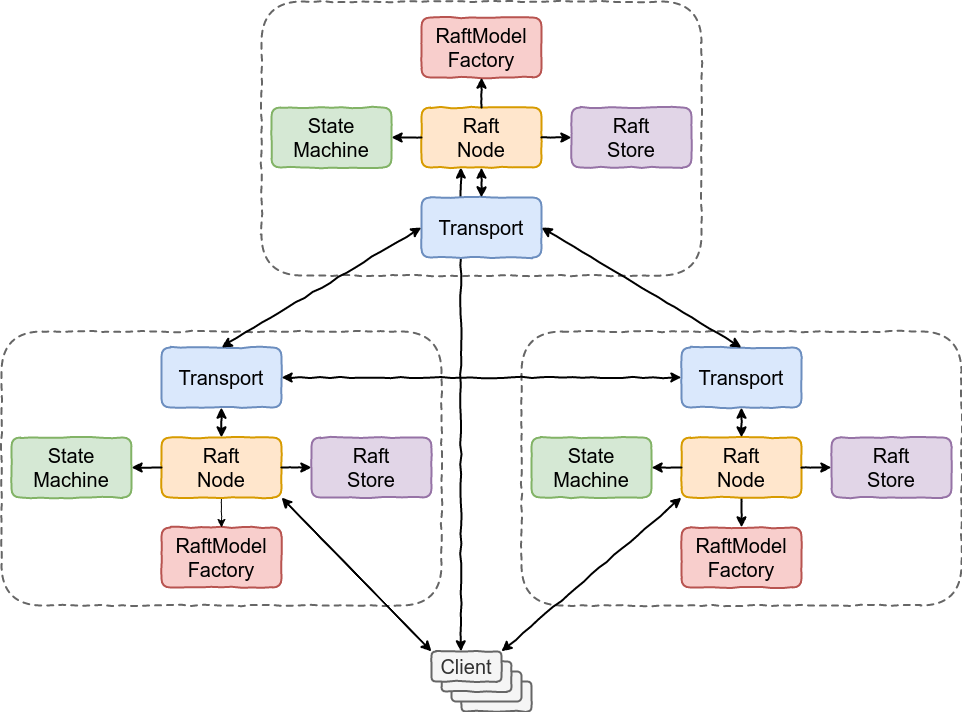

  <section class="mr-doc-hero">
    <h1 class="mr-page-title mr-doc-title">Main Abstractions</h1>
    

      This is the conceptual map of MicroRaft. Read it before the tutorial if
      you want the names, responsibilities, and extension points to make sense
      while you wire your own service.
    

  </section>
  <section class="mr-doc-summary">
    <article class="mr-doc-summary-card">
      <strong>Use this page when</strong>
      You already know you want MicroRaft and now need the integration vocabulary.
    </article>
    <article class="mr-doc-summary-card">
      <strong>Focus on</strong>
      <code>RaftNode</code> as the core runtime, then <code>StateMachine</code>, <code>Transport</code>, and <code>RaftStore</code> as your boundaries.
    </article>
    <article class="mr-doc-summary-card">
      <strong>Read next</strong>
      Open the atomic register tutorial once the names and responsibilities below feel familiar.
    </article>
  </section>

  <section class="mr-doc-band">
    <h2>How to read this page</h2>
    <ul class="mr-doc-list">
      <li><code>RaftNode</code> is the core runtime object you embed</li>
      <li><code>StateMachine</code>, <code>Transport</code>, and <code>RaftStore</code> are the boundaries you implement around it</li>
      <li><code>RaftConfig</code> controls protocol-level behavior and operational tradeoffs</li>
    </ul>
  </section>

## `RaftConfig`

[`RaftConfig`](https://github.com/MicroRaft/MicroRaft/blob/master/microraft/src/main/java/io/microraft/RaftConfig.java)
contains configuration options related to the
Raft consensus algorithm and MicroRaft's implementation. Please check the
[Configuration section](configuration.md) for details.

  <strong>What this section clarifies</strong>
  
<code>RaftConfig</code> is where protocol behavior becomes an operational tradeoff. This is the abstraction to revisit when you need to tune latency, elections, batching, or snapshots.

## `RaftNode`

[`RaftNode`](https://github.com/MicroRaft/MicroRaft/blob/master/microraft/src/main/java/io/microraft/RaftNode.java)
runs the Raft consensus algorithm as a member of
a Raft group. A Raft group is a cluster of `RaftNode` instances that behave as a
_replicated state machine_. `RaftNode` contains APIs for replicating operations,
performing queries, applying membership changes in the Raft group, handling Raft
RPCs and responses, etc.

Raft nodes are identified by `[group id, node id]` pairs. Multiple Raft groups
can run in the same environment, distributed or even in a single JVM process,
and they can be discriminated from each other with unique group ids. A single
JVM process can run multiple Raft nodes that belong to different Raft groups or
even the same Raft group.

`RaftNode`s execute the Raft consensus algorithm with the
[Actor model](https://en.wikipedia.org/wiki/Actor_model). In this model, each
`RaftNode` runs in a single-threaded manner. It
uses a `RaftNodeExecutor` to sequentially handle API calls and `RaftMessage`
objects sent by other `RaftNode`s. The communication between `RaftNode`s are
implemented with the message-passing approach and abstracted away with the
`Transport` interface.

In addition to these interfaces that abstract away task execution and
networking, `RaftNode`s use `StateMachine` objects to execute queries and
committed operations, and `RaftStore` objects to persist internal Raft state to
stable storage to be able to recover from crashes.

All of these abstractions are explained below.

  <strong>What this section clarifies</strong>
  
<code>RaftNode</code> is the center of the system. It owns protocol execution, but depends on your service boundaries for persistence, transport, and state machine behavior.

  <article class="mr-doc-card">
    <h3>Runtime concepts</h3>
    <ul class="mr-doc-list">
      <li><code>RaftNode</code> is the core runtime you embed</li>
      <li><code>RaftRole</code> and <code>RaftNodeStatus</code> describe cluster behavior over time</li>
    </ul>
  </article>
  <article class="mr-doc-card">
    <h3>Integration boundaries</h3>
    <ul class="mr-doc-list">
      <li><code>Transport</code> covers networking</li>
      <li><code>StateMachine</code> covers deterministic business logic</li>
      <li><code>RaftStore</code> covers durability and recovery</li>
    </ul>
  </article>
  <article class="mr-doc-card">
    <h3>Protocol surfaces</h3>
    <ul class="mr-doc-list">
      <li><code>RaftConfig</code> tunes timing and replication</li>
      <li><code>RaftModel</code> and <code>RaftModelFactory</code> define on-wire and on-disk objects</li>
    </ul>
  </article>
  <article class="mr-doc-card">
    <h3>Use this page for</h3>
    <ul class="mr-doc-list">
      <li>learning the vocabulary before the tutorial</li>
      <li>finding the right extension point for your integration</li>
      <li>understanding what MicroRaft does not implement for you</li>
    </ul>
  </article>

## `RaftEndpoint`

[`RaftEndpoint`](https://github.com/MicroRaft/MicroRaft/blob/master/microraft/src/main/java/io/microraft/RaftEndpoint.java)
represents an endpoint that participates to
at least one Raft group and executes the Raft consensus algorithm with a
`RaftNode`.
 
`RaftNode` differentiates members of a Raft group with a unique id. MicroRaft
users need to provide a unique id for each `RaftEndpoint`. Other than this
information, `RaftEndpoint` implementations can contain custom fields, such as
network addresses and tags, to be utilized by `Transport` implementations.

  <strong>What this section clarifies</strong>
  
<code>RaftEndpoint</code> is identity, not business logic. Keep it stable and serializable enough for your transport and discovery story.

## `RaftRole`

[`RaftRole`](https://github.com/MicroRaft/MicroRaft/blob/master/microraft/src/main/java/io/microraft/RaftRole.java)
denotes the roles of `RaftNode`s as specified in
the Raft consensus algorithm. Currently, MicroRaft implements the main roles
defined in the paper: `LEADER`, `CANDIDATE`, and `FOLLOWER`. Moreover, it also
implements an extension adding non-voting members: `LEARNER`. The `WITNESS` role
is not implemented yet, but it's on the roadmap.

  <strong>What this section clarifies</strong>
  
<code>RaftRole</code> tells you how a node participates in protocol progress. It is the right lens for understanding elections, replication authority, and learner behavior.

## `RaftNodeStatus`

[`RaftNodeStatus`](https://github.com/MicroRaft/MicroRaft/blob/master/microraft/src/main/java/io/microraft/RaftNodeStatus.java)
denotes the statuses of a `RaftNode` during
its own and its Raft group's lifecycle. A `RaftNode` is in the `INITIAL` status
when it is created, and moves to the `ACTIVE` status when it is started with a
`RaftNode.start()` call. It stays in this status until either a membership
change is triggered in the Raft group, or either the Raft group or Raft node is
terminated.

  <strong>What this section clarifies</strong>
  
<code>RaftNodeStatus</code> is broader than role. It helps you reason about lifecycle transitions such as startup, active service, termination, and membership-driven changes.

## `StateMachine`

[`StateMachine`](https://github.com/MicroRaft/MicroRaft/blob/master/microraft/src/main/java/io/microraft/statemachine/StateMachine.java)
enables users to implement arbitrary
services, such as an atomic register or a key-value store, and execute
operations on them. Currently, MicroRaft supports memory-based state machines
with datasets in the gigabytes.

`RaftNode` does not deal with the actual logic of committed operations. Once a
given operation is committed with the Raft consensus algorithm, i.e., it is
replicated to the majority of the Raft group, the operation is passed to the
provided `StateMachine` implementation. It is the `StateMachine`
implementation's responsibility to ensure deterministic execution of committed
operations.

Since `RaftNodeExecutor` ensures the thread-safe execution of the tasks
submitted by `RaftNode`s, which include actual execution of committed
user-supplied operations, `StateMachine` implementations do not need to be
thread-safe.

  <strong>What this section clarifies</strong>
  
<code>StateMachine</code> is where your product logic lives. The key contract is deterministic execution, not framework integration convenience.

## `RaftModel` and `RaftModelFactory`

[`RaftModel`](https://github.com/MicroRaft/MicroRaft/blob/master/microraft/src/main/java/io/microraft/model/RaftModel.java)
is the base interface for the objects that hit network and disk. There are 2
other interfaces extending this interface:
[`BaseLogEntry`](https://github.com/MicroRaft/MicroRaft/blob/master/microraft/src/main/java/io/microraft/model/log/BaseLogEntry.java)
and
[`RaftMessage`](https://github.com/MicroRaft/MicroRaft/blob/master/microraft/src/main/java/io/microraft/model/message/RaftMessage.java).
`BaseLogEntry` is used for representing log
and snapshot entries stored in the Raft log. `RaftMessage` is used for Raft RPCs
and their responses. Please see the interfaces inside
[`io.microraft.model`](https://github.com/MicroRaft/MicroRaft/tree/master/microraft/src/main/java/io/microraft/model)
for more details. In addition, there is a
[`RaftModelFactory`](https://github.com/MicroRaft/MicroRaft/blob/master/microraft/src/main/java/io/microraft/model/RaftModelFactory.java)
interface for creating `RaftModel`
objects with the builder pattern.

MicroRaft comes with a default POJO-style implementation of these interfaces
available under the
[`io.microraft.model.impl`](https://github.com/MicroRaft/MicroRaft/tree/master/microraft/src/main/java/io/microraft/model/impl)
package. Users of MicroRaft can define serialization & deserialization
strategies for the default implementation objects, or implement the
`RaftModel` interfaces with a serialization framework, such as
[Protocol Buffers](https://developers.google.com/protocol-buffers).  

  <strong>What this section clarifies</strong>
  
<code>RaftModel</code> and <code>RaftModelFactory</code> define the objects that cross network and storage boundaries. Reach for them when the default POJO model is not enough for your serialization stack.

## `Transport`

[`Transport`](https://github.com/MicroRaft/MicroRaft/blob/master/microraft/src/main/java/io/microraft/transport/Transport.java)
is used for communicating Raft nodes with each other.
[`Transport`](https://github.com/MicroRaft/MicroRaft/blob/master/microraft/src/main/java/io/microraft/transport/Transport.java)
implementations must be able to serialize
[`RaftMessage`](https://github.com/MicroRaft/MicroRaft/blob/master/microraft/src/main/java/io/microraft/model/message/RaftMessage.java)
objects created by
[`RaftModelFactory`](https://github.com/MicroRaft/MicroRaft/blob/master/microraft/src/main/java/io/microraft/model/RaftModelFactory.java).
MicroRaft requires a minimum set of
functionality for networking. There are only two methods in this interface, one
for sending a
[`RaftMessage`](https://github.com/MicroRaft/MicroRaft/blob/master/microraft/src/main/java/io/microraft/model/message/RaftMessage.java)
to a
[`RaftEndpoint`](https://github.com/MicroRaft/MicroRaft/blob/master/microraft/src/main/java/io/microraft/RaftEndpoint.java)
and another one for checking reachability of a
[`RaftEndpoint`](https://github.com/MicroRaft/MicroRaft/blob/master/microraft/src/main/java/io/microraft/RaftEndpoint.java).

  <strong>What this section clarifies</strong>
  
<code>Transport</code> is intentionally narrow. MicroRaft expects you to bring the networking system, but it keeps the required contract small.

## `RaftStore` and `RestoredRaftState`

[`RaftStore`](https://github.com/MicroRaft/MicroRaft/blob/master/microraft/src/main/java/io/microraft/persistence/RaftStore.java)
is used for persisting the internal state of the
Raft consensus algorithm. Its implementations must provide the durability
guarantees defined in the interface.

If a `RaftNode` crashes, its persisted state could be read back from stable
storage into a
[`RestoredRaftState`](https://github.com/MicroRaft/MicroRaft/blob/master/microraft/src/main/java/io/microraft/persistence/RestoredRaftState.java)
object and the `RaftNode` could be
restored back. `RestoredRaftState` contains all the necessary information to
recover `RaftNode` instances from crashes.

  
Important

  
<code>RaftStore</code> does not persist internal state of <code>StateMachine</code> implementations. Upon recovery, a <code>RaftNode</code> starts with an empty state machine, discovers the current commit index, and re-executes Raft log entries to rebuild state.

  <strong>What this section clarifies</strong>
  
<code>RaftStore</code> covers protocol durability, not full application recovery. Your service still owns the broader persistence and replay story.

## `RaftNodeExecutor`

[`RaftNodeExecutor`](https://github.com/MicroRaft/MicroRaft/blob/master/microraft/src/main/java/io/microraft/execution/RaftNodeExecutor.java)
is used by
[`RaftNode`](https://github.com/MicroRaft/MicroRaft/blob/master/microraft/src/main/java/io/microraft/RaftNode.java)
to execute the Raft consensus algorithm with the
[Actor model](https://en.wikipedia.org/wiki/Actor_model).

A
[`RaftNode`](https://github.com/MicroRaft/MicroRaft/blob/master/microraft/src/main/java/io/microraft/RaftNode.java)
runs by submitting tasks to its
[`RaftNodeExecutor`](https://github.com/MicroRaft/MicroRaft/blob/master/microraft/src/main/java/io/microraft/execution/RaftNodeExecutor.java).
All tasks submitted by a
[`RaftNode`](https://github.com/MicroRaft/MicroRaft/blob/master/microraft/src/main/java/io/microraft/RaftNode.java)
must be executed serially, with maintaining the
[happens-before relationship](https://docs.oracle.com/javase/specs/jls/se8/html/jls-17.html),
so that the Raft consensus
algorithm and the user-provided state machine logic could be executed without
synchronization.
 
MicroRaft contains a default implementation,
[`DefaultRaftNodeExecutor`](https://github.com/MicroRaft/MicroRaft/blob/master/microraft/src/main/java/io/microraft/execution/impl/DefaultRaftNodeExecutor.java).
It internally uses a
single-threaded `ScheduledExecutorService` and should be suitable for most of
the use-cases. Users of MicroRaft can provide their own
[`RaftNodeExecutor`](https://github.com/MicroRaft/MicroRaft/blob/master/microraft/src/main/java/io/microraft/execution/RaftNodeExecutor.java)
implementations if they want to run
[`RaftNode`](https://github.com/MicroRaft/MicroRaft/blob/master/microraft/src/main/java/io/microraft/RaftNode.java)s
in their own threading system according to the
rules defined by MicroRaft.  

  <strong>What this section clarifies</strong>
  
<code>RaftNodeExecutor</code> is the concurrency boundary. Change it only if you need MicroRaft to live inside an existing execution model you already trust.

## `RaftException`

[`RaftException`](https://github.com/MicroRaft/MicroRaft/blob/master/microraft/src/main/java/io/microraft/exception/RaftException.java)
is the base class for Raft-related exceptions. MicroRaft defines a number of
[custom exceptions](https://github.com/MicroRaft/MicroRaft/tree/master/microraft/src/main/java/io/microraft/exception)
to report some certain failure scenarios
to clients.

Running a Group

## How to run a Raft group

  <article class="mr-doc-card">
    <h3>Always required</h3>
    <ul class="mr-doc-list">
      <li>endpoint identity</li>
      <li>state machine implementation</li>
      <li>transport implementation</li>
    </ul>
  </article>
  <article class="mr-doc-card">
    <h3>Optional but common</h3>
    <ul class="mr-doc-list">
      <li>custom model serialization</li>
      <li>durable <code>RaftStore</code></li>
      <li>custom executor integration</li>
    </ul>
  </article>

In order to run a Raft group (i.e., Raft cluster) using MicroRaft, we need to:

* implement the `RaftEndpoint` interface to identify `RaftNode`s we are going to
  run,
 
* provide a `StateMachine` implementation for the actual state machine logic
  (key-value store, atomic register, etc.),

* __(optional)__ implement the `RaftModel` and `RaftModelFactory` interfaces to
  create Raft RPC request / response objects and Raft log entries, or simply use
  the default POJO-style implementation of these interfaces available under the
  `io.microraft.model.impl` package,

* provide a `Transport` implementation to realize serialization of `RaftModel`
  objects and networking, 

* __(optional)__ provide a `RaftStore` implementation if we want to restore
  crashed Raft nodes. We can persist the internal Raft node state to stable
  storage via the `RaftStore` interface and recover from Raft node crashes by
  restoring persisted Raft state. Otherwise, we could use the already-existing
  `NopRaftStore` utility which makes the internal Raft state volatile and
  disables crash-recovery. If we don't implement persistence, crashed Raft nodes
  cannot be restarted and need to be removed from the Raft group to not to
  damage availability. Note that the lack of persistence limits the overall
  fault tolerance capabilities of Raft groups. Please refer to the [Resiliency
  and Fault Tolerance](resiliency-and-fault-tolerance.md) section to learn more
  about MicroRaft's fault tolerance capabilities.

* build a discovery and RPC mechanism to replicate and commit operations on a
  Raft group. This is required
  because simplicity is the primary concern for MicroRaft's design philosophy.
  MicroRaft offers a minimum API set to cover the fundamental functionality and
  enables its users to implement higher-level abstractions, such as an RPC
  system with request routing, retries, and deduplication. For instance,
  MicroRaft neither broadcasts the Raft group members to any external discovery
  system, nor integrates with any observability tool, but it exposes all
  necessary information, such as Raft group members, leader Raft endpoint, term,
  commit index, via
  [`RaftNodeReport`](https://github.com/MicroRaft/MicroRaft/blob/master/microraft/src/main/java/io/microraft/report/RaftNodeReport.java),
  which can be accessed via `RaftNode.getReport()` and
  [`RaftNodeReportListener`](https://github.com/MicroRaft/MicroRaft/blob/master/microraft/src/main/java/io/microraft/report/RaftNodeReportListener.java).
  We can use that information to feed our discovery services and monitoring
  tools. Similarly, the public APIs on `RaftNode` do not employ request routing
  or retry mechanisms. For instance, if a client tries to replicate an
  operation via a follower or a candidate `RaftNode`, `RaftNode` responds back
  with a
  [`NotLeaderException`](https://github.com/MicroRaft/MicroRaft/blob/master/microraft/src/main/java/io/microraft/exception/NotLeaderException.java),
  instead of internally forwarding the operation to the leader `RaftNode`.
  `NotLeaderException` contains
  `RaftEndpoint` of the current leader `RaftNode` so that clients can send their
  requests to it.

  
Design boundary

  
MicroRaft gives you the consensus core. Discovery, request routing, retries, and observability wiring still belong to the service you build around it.

In the next section, we will build an atomic register on top of MicroRaft to
demonstrate how to implement and use MicroRaft's main abstractions.

Architecture

## Architectural overview of a Raft group

The following figure depicts an architectural overview of a Raft group based on
the main abstractions explained above. Clients talk to the leader `RaftNode` for
replicating operations. They can talk to both the leader and follower
`RaftNode`s for running queries with different consistency guarantees.
`RaftNode` uses `RaftModelFactory` to create Raft log entries, snapshot entries,
and Raft RPC request and response objects. Each `RaftNode` uses its `Transport`
object to communicate with the other `RaftNode`s. It also uses `RaftStore` to
persist Raft log entries and snapshots to stable storage. Last, once a log entry
is committed, i.e, it is successfully replicated to the majority of the Raft
group, its operation is passed to `StateMachine` for execution, and output of
the execution is returned to the client by the leader `RaftNode`.

{: style="height:592px;width:800px"}

Next Up

## What is next?

In the [next section](tutorial-building-an-atomic-register.md), we will build an atomic
register on top of MicroRaft.
